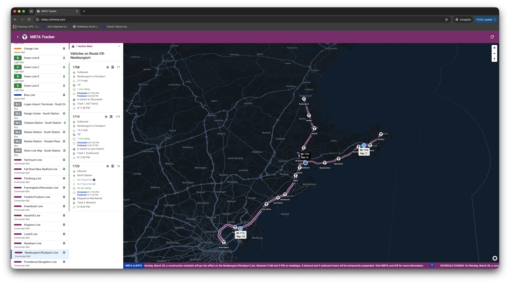
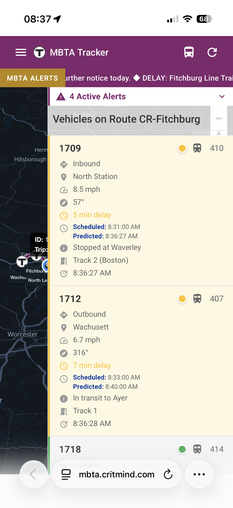
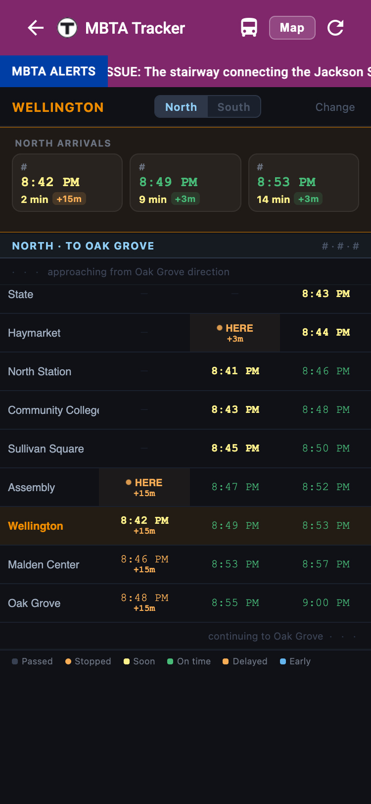

# MBTA Tracker

Real-time vehicle tracking for the MBTA network. Select a route in the sidebar and watch buses, trains, and commuter rail cars move on the map. Click a vehicle to see its current stop, next arrival prediction, and schedule status.

**Live:** https://mbta.critmind.com/

<table><tr>
<td></td>
<td></td>
<td></td>
</tr></table>

## Architecture

The production application is serverless and snapshot-driven:

```text
Angular → CloudFront
  ├─ /api/control/* → API Gateway → activity Lambda → DynamoDB
  ├─ /api/*         → private snapshot S3 bucket
  └─ /*             → private frontend S3 bucket

EventBridge → Step Functions → scheduled refresh Lambdas
Refresh Lambdas → DynamoDB rate permit → MBTA → complete S3 snapshots
```

Browser reads never invoke Lambda or call MBTA. Route activity heartbeats keep only recently selected routes hot, so adding clients does not increase upstream MBTA traffic for the same set of routes. A DynamoDB token bucket, conditional job locks, and fail-closed behavior enforce the application safety budget.

| Layer | Tech |
|---|---|
| Publishers | Scala 3.3, Java 21 Lambda container, JDK `HttpClient`, Spray JSON |
| Frontend | Angular 20, MapLibre GL JS 5, Angular Material, RxJS |
| Storage/control | Private S3 snapshots, DynamoDB activity/rate/lock table, Secrets Manager |
| Scheduling | EventBridge and Standard Step Functions |
| Delivery | CloudFront, Origin Access Control, API Gateway heartbeat route, ACM, Route 53 |
| Build | Gradle 9, Angular CLI, Docker buildx, OpenTofu |

## Running locally

You need JDK 21, Node.js 20+, and npm. Set an MBTA API key for the authenticated limit:

```bash
export MBTA_API_KEY=your_key_here
```

Run the filesystem-backed snapshot publisher and Angular separately:

```bash
# Terminal 1 — publisher/API on http://127.0.0.1:8080
./gradlew snapshotDev

# Terminal 2 — UI on http://localhost:4200, proxying /api/** to port 8080
cd frontend && npm start
```

Local snapshots are atomically replaced under `build/local-snapshots`. The local control store uses the same active-route lifecycle with a conservative in-memory limiter.

## Project layout

```text
source/scala/snapshot/     Lambda handler, models, transforms, publishers,
                           AWS stores/client, limiter, and local server
source/test/scala/snapshot Backend transformation, service, and limiter tests
frontend/src/app/          Angular UI, services, schemas, and freshness behavior
infra/                     Serverless production OpenTofu stack
Dockerfile.lambda          Java 21/arm64 Lambda image
deploy.gradle              Bootstrap, build, deploy, seed, and smoke workflows
```

## Public API

```text
GET /api/routes
GET /api/alerts
GET /api/status
GET /api/route/:id/vehicles
GET /api/route/:id/shapes
GET /api/route/:id/stops
GET /api/route/:id/board
GET /api/route/:id/alerts
PUT /api/control/routes/:id/activity
```

All GET responses are complete S3 objects served through CloudFront. The control route is the only public request path that invokes Lambda.

## Verification

```bash
./gradlew build
cd frontend && npm test -- --watch=false --browsers=ChromeHeadless
cd frontend && npm run build
cd infra && ../build/tools/tofu fmt -check -recursive && ../build/tools/tofu validate
```

The Scala build enforces `OrganizeImports`, `RemoveUnused`, and `DisableSyntax` through Scalafix.

## Deployment

See [documents/deployment-guide.md](documents/deployment-guide.md). After one-time bootstrap, the complete production rollout is:

```bash
./gradlew --no-daemon deploy
```
